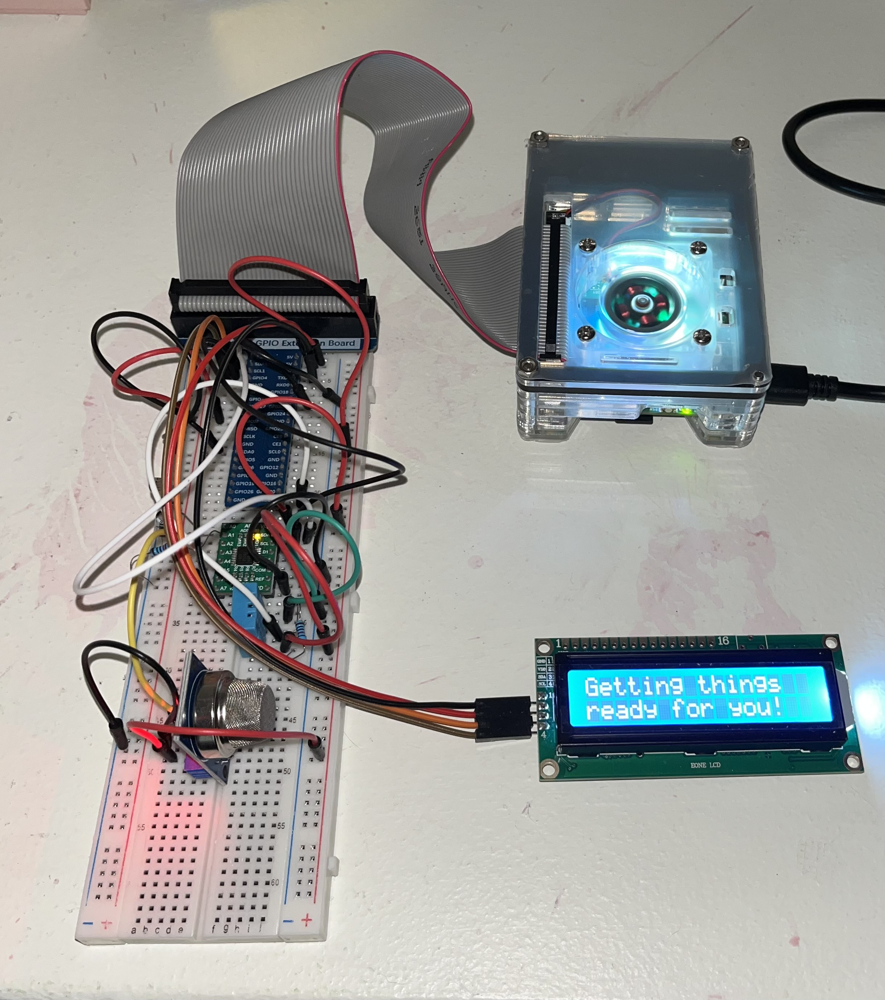
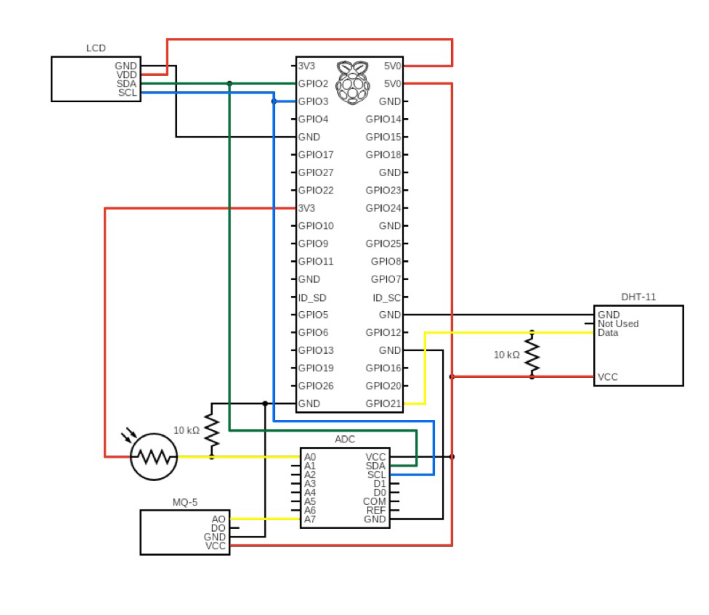

# RaspberryPi: Home Monitoring Hub for Temperature, Humidity, Light, and Gas Levels

This project uses a Raspberry Pi 5 to monitor temperature, humidity, light levels, and gas presence (CO and LPG). The gas sensor detects carbon monoxide and LPG, and if gas is detected, the ppm is sent to a MariaDB database. An alert is also displayed on the LCD, indicating gas detection. Data is collected using C, sent to the database via Apache2 and PHP, and displayed on an LCD through a Python frontend. The system shows real-time data along with 7-day trends from the database.

## Demos

*System Demo #1: Display data*


*System Demo #2: Gas detection*


## Authors
|                                                |                                          |
|:----------------------------------------------:|:----------------------------------------:|
|  |  |
| *Alejandro Barranco-Leyte*                    | *Batyr Rasulov*                          |


## Project Overview

- **Hardware**: Raspberry Pi 5, DHT11 Sensor (Temperature and Humidity), Photoresistor (Light Levels), I2C LCD Display, MQ-5 Gas Sensor
- **Backend**: Data collection and database management in C, sending data to MariaDB using MariaDB C connector.
- **Frontend**: Real-time display on an I2C LCD with Python via socket communication. It also fetches and displays 7-day trends from the database.

# Setup Instructions

## Hardware Image

The following image shows the physical setup of the Raspberry Pi and its connected components. This is for display purposes, showing how everything is arranged in the system. For correct wiring, please see next section.



## Hardware Configuration

The following image shows the correct wiring for all the sensors used in the project:



This diagram helps in visualizing the connections between the Raspberry Pi and the connected sensors.

## Database Configuration

1. Install Apache, PHP, MariaDB, and PHPMyAdmin:
    ```bash
    sudo apt install apache2 php php-mysql mariadb-server phpmyadmin
    ```
2. Include the PHPMyAdmin configuration in Apache, to make PHPMyAdmin accessible through the web browser:
    ```bash
    echo 'Include /etc/phpmyadmin/apache.conf' | sudo tee -a /etc/apache2/apache2.conf
    ```
3. Set a root password and other configurations as you wish:
    ```bash
    sudo mysql_secure_installation
    ```
4. Enable PHP MySQL module:
    ```bash
    sudo phpenmod mysqli
    ```
5. Install MariaDB development libraries:
    ```bash
    sudo apt-get install libmariadb-dev
    ```
6. Copy MariaDB drivers to your project:
    ```bash
    sudo cp -r /usr/include/mariadb /home/{your-username}/{project-directory}
    ```
7. Open PHPMyAdmin in your browser:
    - If you're working directly on the Raspberry Pi, you can use `localhost`:
      ```bash
      http://localhost/phpmyadmin
      ```
    - If you're accessing the Pi from a different device, use the Pi's IP address:
      ```bash
      http://<your-pi-ip-address>/phpmyadmin
      ```
8. In PHPMyAdmin, select your database, then run the SQL script located at `table_creation.sql`:
    - Log in with the credentials you made in Step 3.
    - Click on the **SQL** tab in the top menu.
    - Use the file upload option or copy/paste the contents of `table_creation.sql` into the query box.
    - Click **Go** to execute the SQL script, which will create the necessary tables in the database.

## C Configuration

1. Install WiringPi (for GPIO access):
   ```bash
   sudo apt-get install wiringpi
   ```
2. To compile your C file:
    ```bash
    gcc main.c dhthw.c adchw.c mq5hw.c -o main -lwiringPi -lmariadb
    ```

## Python Configuration
1. Install MySQL connector for Python:
    ```bash
    sudo pip3 install mysql-connector-python
    ```
    **Note:** You might need to break system packages for this installation. Please refer to the official [MySQL Connector for Python documentation](https://dev.mysql.com/doc/connector-python/en/) for any potential system package conflicts or resolutions.
2. Clone the LCD driver repository:
    ```bash
    cd /home/${USER}/
    git clone https://github.com/the-raspberry-pi-guy/lcd.git
    cd lcd/
    ```
3. Run the automatic installation script:
    ```bash
    sudo ./install.sh
    ```
4. Copy the LCD drivers to your project:
    ```bash
    sudo cp -r drivers /home/{your-username}/{project-directory}
    ```
5. Enable I2C on the Raspberry Pi:
    ```bash
    sudo raspi-config
    ```
    - Go to "Interfacing Options" and enable I2C.
6. Modify the i2c_dev.py file:
    - Add the following method to the Lcd class for scrolling text:
    ```python
    def scroll_text(self, text, speed, iterations=1):
    text_len = len(text)
    display_width = 16  # Width of the LCD display
    
    for _ in range(iterations):
        for i in range(text_len - display_width + 1):
            self.lcd_clear()
            display_text = text[i:i + display_width]
            self.lcd_display_string(display_text, 1)

            if i == 0:
                sleep(2)  # Hold at the start of the scroll
            else:
                sleep(speed)
    ```

## Running the Project
1. Start the Python frontend to display real-time data
    ```bash
    python display.py
    ```
2. Run the main C program:
    ```bash
    ./main
    ```
This will start collecting data from the sensors and send it to the database while displaying real-time information and trends on the LCD.

